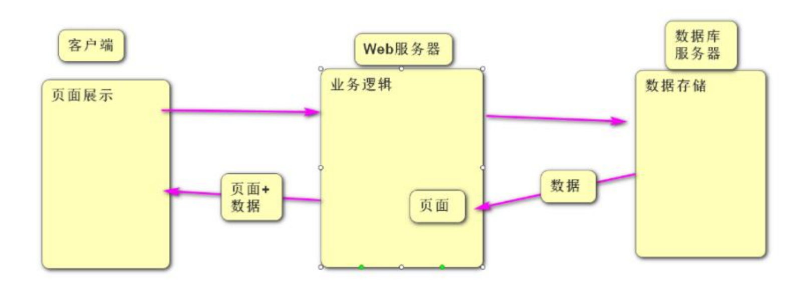
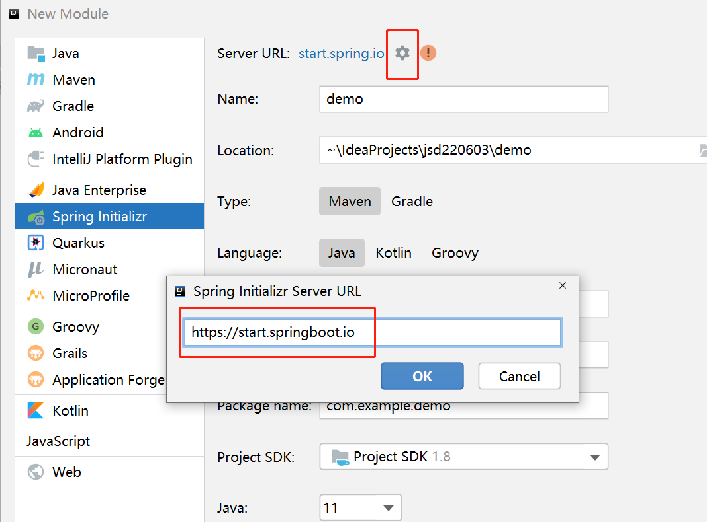
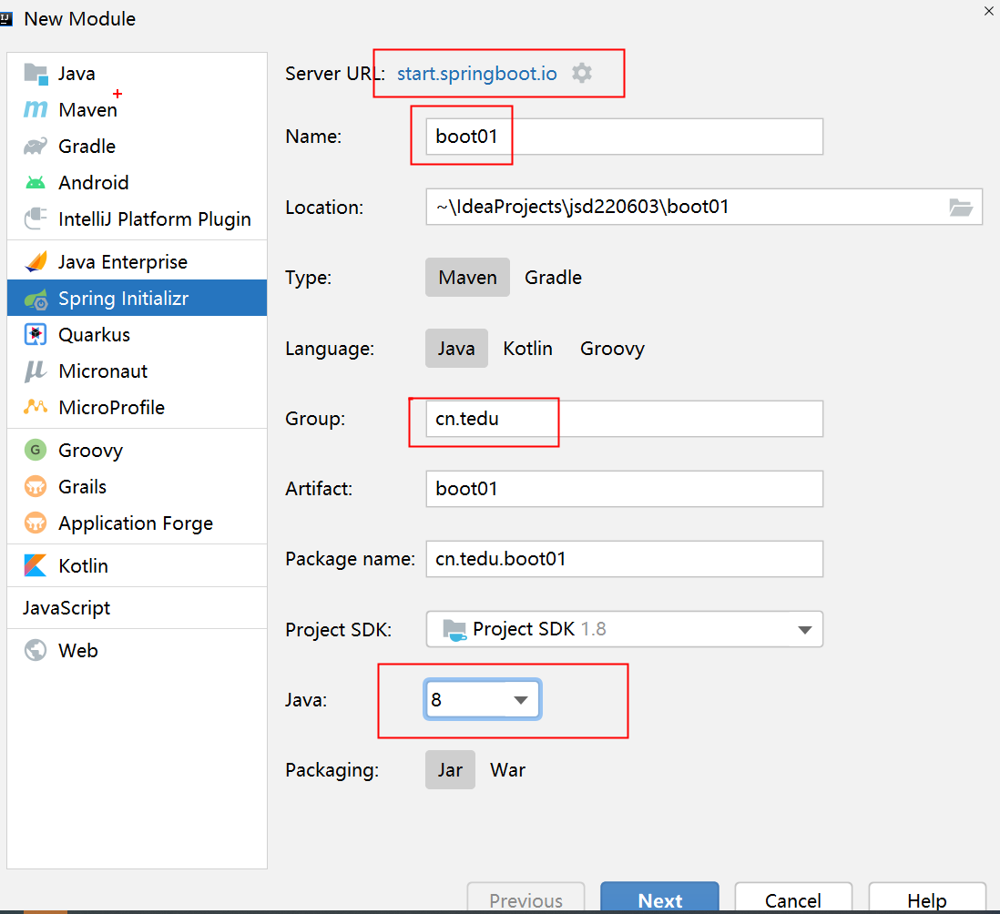
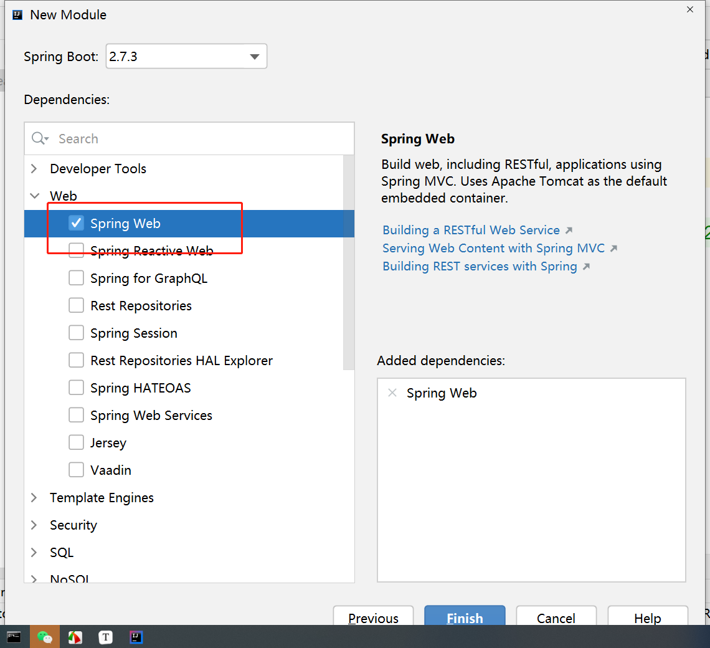
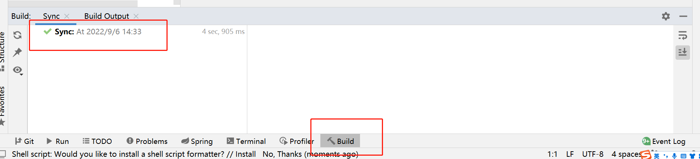
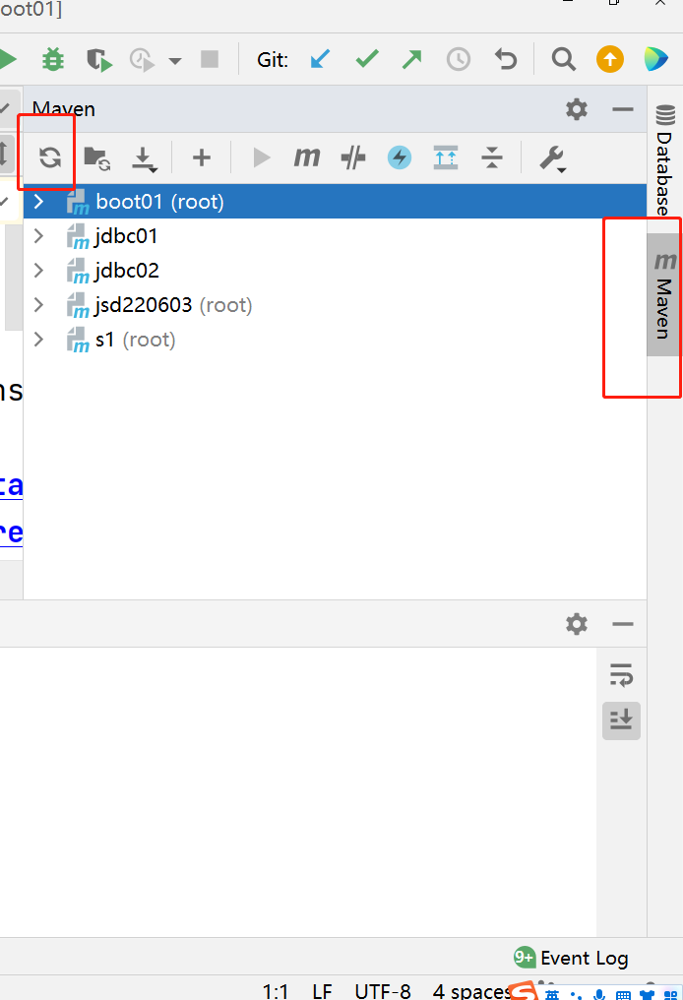

### SpringBoot

- 此阶段学习的内容主要是如何接收客户端请求以及如何做出响应

### 什么是服务器?

- 服务器就是一台高性能的电脑   

### 什么是Web服务器?

- 在高性能电脑上安装了Web服务软件

### 什么是Web服务软件?

- Web服务软件是不具备任何业务功能的,可以理解为是一个容器, 用来装实现具体业务功能的组件(组件指Servlet,Controller是将多个有相关性的Servlet整合到了一个类文件中)

- Web服务软件做了哪些事儿? 
  - 搭建底层的网络连接 
  - 负责根据客户端发出的静态资源请求找到对应的静态资源文件并响应给客户端
  - 负责根据客户端发出的动态请求找到对应的Controller里面的方法并执行

### 后端的三大框架

- SpringMVC: 从第二阶段开始接触 讲到第四阶段 
- Spring: 从第四个阶段开始接触到最后
- Mybatis: 从第三阶段开始到最后

### SpringBoot框架

- 如果不使用SpringBoot框架创建Maven工程, 工程里面如果需要添加其它框架, 除了需要在pom.xml文件中添加大量的依赖信息以外,很多的框架还需要有对应的xml配置文件,  在xml配置文件中还需要书写大量的配置信息, 这些工作都需要程序员完成,  使用SpringBoot框架创建工程时,如果需要引入其它框架只需要通过打钩的方式即可把其它框架引入到自己的工程 不需要写配置文件,SpringBoot框架帮助程序员做好了其它工作

### 创建SpringBoot工程

1. 创建SpringBoot工程时需要将 url地址改成https://start.springboot.io

2. 修改工程名, group,Java版本  

   

3. 勾选需要引入到工程中的框架

   

4. 创建完工程后在Build页卡中显示 绿色的对勾

   

5. 如果没有绿色对勾 而是红色报错的话,按照一下方案解决:

   1. 刷新Maven    

      

		2. 如果刷新maven没有解决,  检查maven配置是否正确, 如果正确 删除.m2文件夹下的repository文件夹,  然后再次刷新maven, 如果还没有解决  删除工程重新创建.

- 如何测试工程是否创建成功?
  - 在static文件夹下 创建index.html页面    
  - 启动工程, 浏览器地址栏中访问:  localhost:8080   