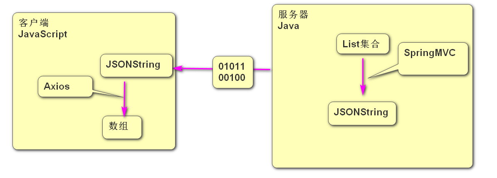

### 前后端分离


- 前后端不分离: 指在Controller中需要处理页面相关代码, 这样就把前端代码和后端代码混在一起了, 如果前端还包括手机端的话, 则需要再准备一套Controller, 这样的话对于后端Java程序员工作量就翻倍了,而且会有大量的重复代码  
- 前后端分离: 指Controller中不再处理页面只提供数据, 不管前端是浏览器还是手机端都一视同仁只返回数据,  这样的话浏览器需要页面需要单独发一次请求获取.  这样的话java程序员只需要提供一套Controller即可 从而提高了开发效率
- 由于前后端分离后,客户端浏览器需要先请求页面,然后在页面加载完之后再请求数据,把请求到的数据显示到页面中,这个过程属于页面的局部刷新, 所以以后考虑了前后端分离问题 就不能再使用同步请求了, 因为只有异步请求才能实现局部刷新


### 商品管理系统(异步版)

1. 创建boot06工程  打钩3个   
2. 配置连接数据库的信息 
3. 添加首页index.html   里面添加  添加商品的超链接  地址/insert.html页面

- 添加商品步骤:

1. 创建insert.html页面, 页面中三个文本框和一个按钮,  文本框和vue的data中的product对象进行双向绑定, 给按钮添加点击事件调用insert方法
2. 在insert方法中发出异步请求把data中的product对象提交到服务器,服务器返回数据后弹出"添加完成" 然后跳转到首页
3. 创建controller.ProductController 并添加insert方法处理/insert请求 返回值为void, 创建Product实体类封装接收到的参数
4. 创建mapper.ProductMapper 并提供insert方法 
5. 在ProductController 调用mapper的insert方法 把接收到的product对象传递进去,不需要给客户端响应任何数据 返回值为void

- 商品列表步骤:

1. 在首页中添加商品列表超链接 请求地址为/list.html
2. 创建list.html页面, 页面中添加表格, 并且让表格和arr数组进行绑定, 在页面中添加created方法,在方法中向/select地址发出异步请求获取所有商品的数据, 把得到的数据直接赋值给arr数组, 由于页面内容和数组进行了绑定所以页面会自动显示出查询到的数据
3. 在ProductController里面创建select方法处理/select请求, 方法中调用mapper的select方法 返回值为List集合里面装着Product对象, 把得到的集合直接响应给客户端,SpringMVC框架当发现响应的内容为自定义对象或集合时 会先转成JSON格式的字符串,然后通过网络传输给客户端,而客户端当发现传递过来的是JSON格式的字符串时Axios框架会自动将JSON格式字符串转成数组或JS对象
4. 实现mapper里面的select方法

- 删除商品步骤:

1. 在list.html页面中添加一列 每一行商品信息的后面加上删除超链接 废掉超链接的跳转功能,给超链接添加点击事件, 点击时调用del 方法 把需要删除的商品id传递过去
2. 在del方法中发出异步的get请求 请求地址为/delete?id=xxx  服务器响应后 刷新页面
3. 在ProductController中创建delete方法处理/delete请求, 方法中调用mapper的deleteById方法把接收到的id传递过去 
4. 实现mapper里面的deleteById方法

- 修改商品步骤:

1. 在list.html页面中 删除按钮的前面添加修改超链接, 请求地址为/update.html?id=xxx  
2. 创建update.html页面, 在页面中准备4个文本框和一个按钮, 让文本框和product对象进行双向绑定, 在页面中添加created方法,实现进入页面后立即向/selectById?id=xxx地址发出请求  请求到的数据为自定义的商品对象(JS对象) 把对象赋值给Vue中和页面进行双向绑定的对象,页面会自动发生改变
3. 在ProductController中添加selectById方法处理/selectById请求, 接收传递过来的id, 然后调用mapper中的selectById方法 返回值为Product对象 把对象直接响应给客户端 
4. 实现mapper里面的selectById方法 
5. 在update.html页面中,给修改按钮添加点击事件, 点击后调用update方法
6. 实现update方法在方法中向/update地址发出异步post请求 把双向绑定的product对象传递给服务器
7. 在ProductController里面添加update方法处理/update请求, 调用mapper的update方法把接收到的product对象传递过去 
8. 实现mapper里面的update方法


### JSON

- JSON是一个轻量级的数据交换格式(数据封装格式)

张三&18&男&3000&18611107362

- 自定义对象转成JSON格式的字符串效果如下

{"name":"张三","age":18,"price":3000,"phone":"186xxxxxxxx"}

- 集合转成JSON格式的字符串效果如下

```json
[{"id":1,"title":"李宁篮球鞋","price":1000.0,"num":100},
 {"id":3,"title":"双飞燕鼠标","price":50.0,"num":1000},
 {"id":5,"title":"罗技键盘","price":200.0,"num":1000}]
```



