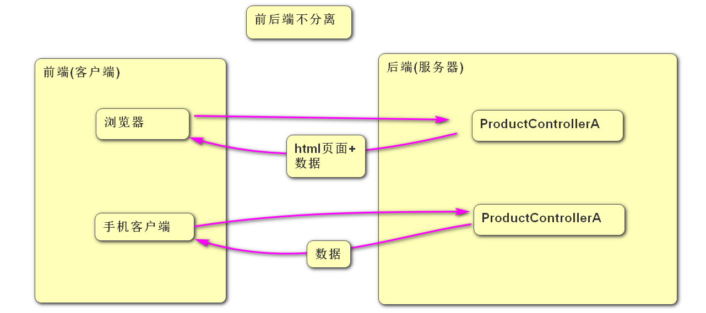
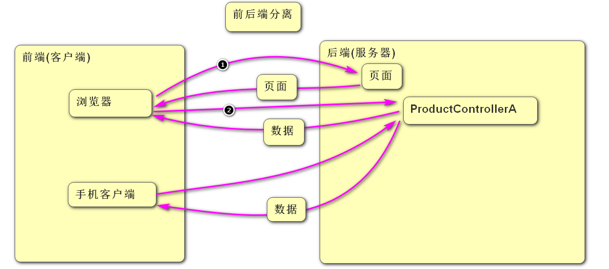

### 商品管理系统(异步版)

1. 创建boot06工程  打钩3个   
2. 配置连接数据库的信息 
3. 添加首页index.html   里面添加  添加商品的超链接  地址/insert.html页面
4. 创建insert.html页面, 页面中三个文本框和一个按钮,  文本框和vue的data中的product对象进行双向绑定, 给按钮添加点击事件调用insert方法
5. 在insert方法中发出异步请求把data中的product对象提交到服务器,服务器返回数据后弹出"添加完成" 然后跳转到首页
6. 创建controller.ProductController 并添加insert方法处理/insert请求 返回值为void, 创建Product实体类封装接收到的参数
7. 创建mapper.ProductMapper 并提供insert方法 
8. 在ProductController 调用mapper的insert方法 把接收到的product对象传递进去,不需要给客户端响应任何数据 返回值为void

### 前后端分离

- 前后端不分离: 指在Controller中需要处理页面相关代码, 这样就把前端代码和后端代码混在一起了, 如果前端还包括手机端的话, 则需要再准备一套Controller, 这样的话对于后端Java程序员工作量就翻倍了,而且会有大量的重复代码  
- 前后端分离: 指Controller中不再处理页面只提供数据, 不管前端是浏览器还是手机端都一视同仁只返回数据,  这样的话浏览器需要页面需要单独发一次请求获取.  这样的话java程序员只需要提供一套Controller即可 从而提高了开发效率
- 由于前后端分离后,客户端浏览器需要先请求页面,然后在页面加载完之后再请求数据,把请求到的数据显示到页面中,这个过程属于页面的局部刷新, 所以以后考虑了前后端分离问题 就不能再使用同步请求了, 因为只有异步请求才能实现局部刷新