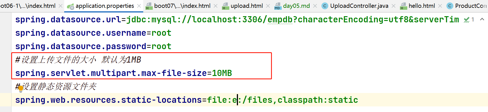
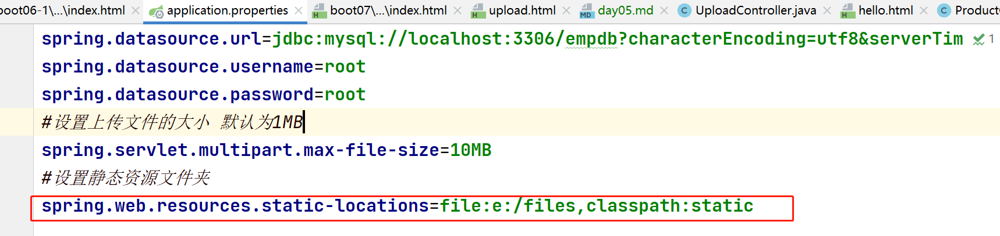
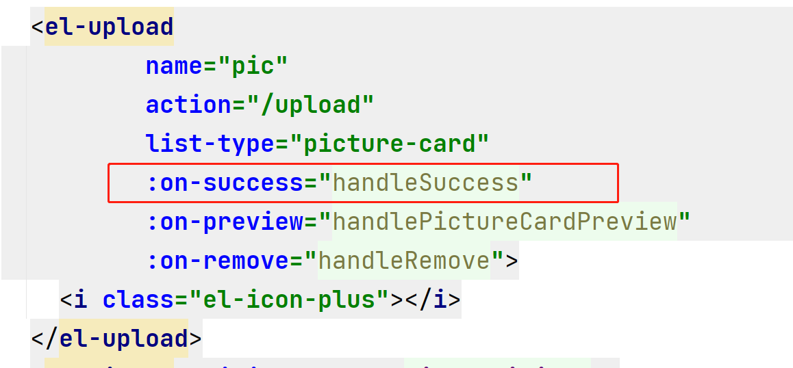

### 文件上传步骤

1. 创建一个html页面,此页面需要用到elementUI组件, 所以从Web阶段day07的hello.html复制粘贴而来
2. 从ElementUI文档中找到Upload组件,  找到里面的照片墙组件, 把相关代码复制粘贴到自己的页面中
3. 修改组件代码中action的地址为/upload  给el-upload组件添加name属性 设置上传文件的参数名

4. 创建UploadController处理 /upload请求, 在参数列表处声明MultipartFile类型的变量接收传递过来的文件参数 soutp控制台输出传递过来的参数 进行测试, 测试前先在application.properties配置文件夹中添加 设置上传文件大小的相关代码

5. 得到图片的原始文件名 取出后缀 然后再得到唯一文件名, 把图片保存到指定的文件夹路径下,如果文件夹不存在需要创建文件夹 
6. 设置静态资源文件夹: 在application.properties配置文件中添加以下内容,因为客户端只能访问到服务器静态资源文件夹的图片, 而工程磨人的静态资源文件夹只有static, 通过以下配置代码可以将files文件夹也设置为静态资源文件夹,这样客户端就可以访问到了

7. 上传图片完成时会调用某个方法,需要通过以下代码进行配置,在调用的方法中可以获得上传成功的图片路径(服务器中保存在磁盘上面的唯一文件名)

   

### 晚课19:40  

1. 考完试之后可以先将微博练习中 登录功能实现
2. 晚课会讲表设计相关的一套面试题

