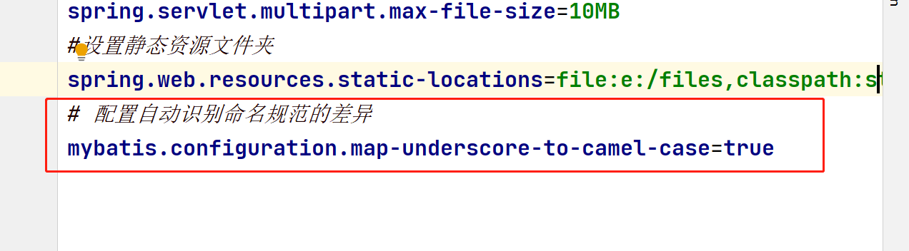

### 后台商品列表展示步骤:

1. 在admin.html页面中删除数组中的假数据, 在created方法中向/product/select发请求获取商品信息把得到的商品信息给到productArr数组
2. 在ProductController里面添加select方法处理/product/select请求 调用mapper里面的select方法把返回的集合直接响应给客户端
3. 实现mapper中的 select方法

### 表字段和属性字段不一致解决方案:

1. 通过别名(这种用法不能复用不推荐)

2. 通过@Result注解  

3. 通过在application.properties里面添加配置信息

   

### 删除商品

1. 给删除按钮添加点击事件 点击时向/product/delete发出请求把商品id传递过去
2. 在ProductController中添加delete方法处理/product/delete请求, 在方法中先通过id查询到商品图片的url,然后删除文件, 删除后调用mapper的deleteById方法 删除数据库里面的数据
3. 实现mapper里面deleteById方法 

### 首页排行榜显示步骤:

1. 删除topArr里面的假数据,  在created方法中向/product/selectTop 发出请求把请求到的数组赋值给topArr
2. 在ProductController中添加selectTop方法处理/product/selectTop,方法中调用mapper的selectTop方法 把接收到的list集合直接响应给客户端
3. 实现mapper中的selectTop方法 ,在SQL语句中通过销量降序排序只查询前6条数据

