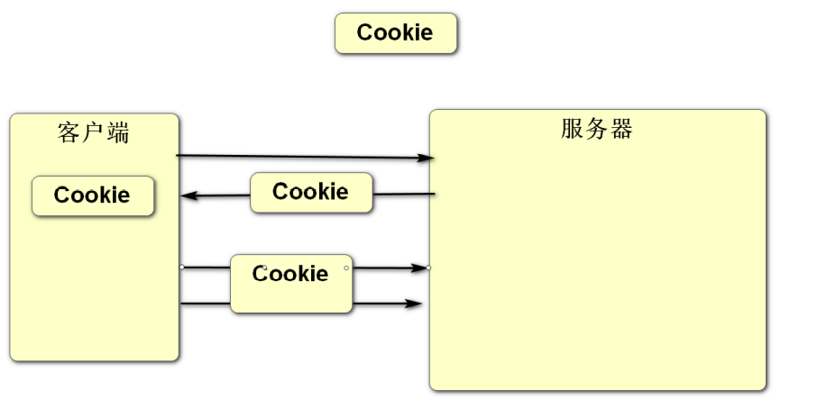
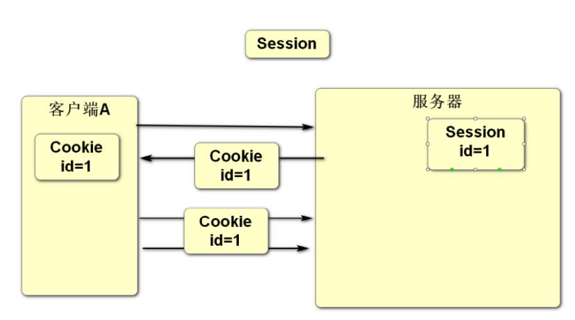

### 修改商品步骤

1. 给后台管理页面添加修改商品按钮,点击时跳转到/update.html页面 
2. 复制insertProduct.html 粘贴改名为update.html
3. 在update.html页面中的created方法中 通过地址栏中id 发请求获取商品信息,把获取到的商品对象赋值给v.p 页面就能回显出商品原来的内容,  在添加图片的组件前面添加一个img图片用来显示之前的图片
4. 商品内容修改完之后,点击修改按钮,向/product/update发出修改请求
5. 在ProductController中添加update方法处理/product/update请求,调用mapper中的update方法
6. 实现mapper中的 update方法

### 会话管理

- 客户端和服务器之间进行数据传输遵循的是HTTP协议,此协议属于无状态协议(一次请求对应一次响应,响应完之后端开连接),服务器是无法跟踪客户端的请求,通过Cookie技术可以给客户端添加一个标识,客户端之后发出的每次请求都会带着这个标识从而让服务器识别此客户端, 但是由于Cookie的数据是保存在客户端的存在被篡改的风险, Session技术是将数据保存在服务器端的这样就可以提高安全性,不存在被篡改的风险

- 通过会话管理相关的cookie和Session技术保存的数据是和客户端相关的数据,而不是用户的数据,用户的数据是保存在数据库中的.

- Cookie: 数据保存在客户端(类似打孔式的会员卡)

  - cookie数据默认保存在浏览器的内存中,当会话结束时cookie会从内存中清除,  cookie也可以修改任意保存时间,只要是设置了时间数据会从内存中保存到磁盘中
  - 只能保存字符串类型的数据
  - 由于cookie保存的数据会随着每次请求一起传递给服务器,Cookie是存在于请求头中的,所以单个cookie的数据存储量只能保存几k的数据
  - 应用场景: 记住用户名和密码 通过cookie实现

  

- Session: 数据保存在服务器(类似银行卡)

  - Session数据是保存在服务器内存中, 由于服务器内存资源紧张 保存的时间只有半个小时左右
  - 可以保存任意对象类型的数据
  - 单个Session没有保存数据量的限制, 但是由于服务器内存资源紧张,也不建议保存大量数据
  - 应用场景: 记住登录状态

### 通过Cookie实现记住用户名和密码

- 登录成功时将用户名和密码通过Cookie下发给客户端,保存在客户端浏览器中

1. 在login.html页面中添加记住用户名和密码的控件 和user里面的rem属性进行双向绑定
2. 在User实体类中添加rem属性 重新生成get set方法 和tostring方法
3. 在UserController 登录成功的时候 创建cookie把用户名和密码装进cookie 发送给客户端
4. 在login.html页面的created方法中获取cookie里面的用户名和密码显示到页面中 

### timestamp时间类型自动更新问题

- timestamp类型默认情况下是 当数据发生改变时，时间自动更新为当前系统时间

- 关闭自动更新

  use cs;

​		alter table product change created created timestamp not null default current_timestamp;

- 打开自动更新

  alter table product change created created timestamp not null default current_timestamp on update current_timestamp;

### 过滤器Filter

- 作用: 过滤器代码可以在客户端请求到资源之前或之后执行, 可以将请求某些资源重复性的代码(比如:判断是否登录)放在过滤器里面,达到重用的作用, 这样只需要写一次即可 , 从而提高开发效率
- 如何使用过滤器? 
  - 创建Filter类文件

