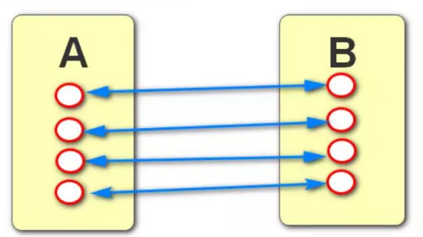
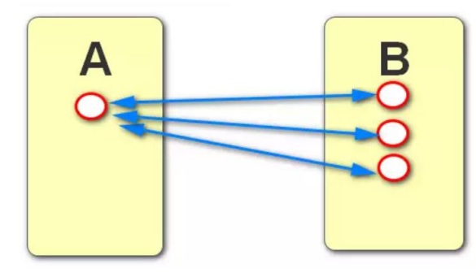
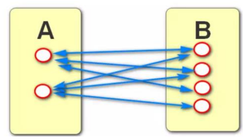

### 综合练习题

use empdb;

1. 查询工资在 1000 到 2000 之间有领导的员工信息

   select * from emp where sal between 1000 and 2000 and manager is not null;

2. 查询有领导的员工工资按照降序排序取前三条数据

   select * from emp where manager is not null order by sal desc limit 0,3;

3. 查询 1 号和 3 号部门出现了哪几种不同的工作

   select distinct job from emp where dept_id in(1,3);

4. 查询每个部门的人数

   select dept_id,count(*) from emp group by dept_id;

5. 查询每种工作有领导的员工人数

   select job,count(*) from emp where manager is not null group by job;

6. 查询每个部门的最低工资,最高工资和平均工资

   select dept_id,min(sal) 最低工资, max(sal) 最高工资, avg(sal) 平均工资 from emp group by dept_id;


### having

- where 后面只能写普通字段条件, 不能写聚合函数条件
- having关键字专门用来写聚合函数条件的, 并且需要和分组group by结合使用, 写在分组的后面

1. 查询每个部门的平均工资,要求平均工资大于2000;

   select dept_id,avg(sal) a from emp  group by dept_id having a>2000;

2. 查询每种工作的人数,只查询人数大于 1 的

   select job,count(*) c from emp group by job having c>1;

3. 查询每个部门的工资总和,只查询有领导的员工, 并且要求工资总和大于 5400.

   select dept_id,sum(sal) s from emp 

   where manager is not null group by dept_id having s>5400;

4. 查询每个部门的平均工资, 只查询工资在 1000 到 3000 之间的,并且过滤掉平均工资低于 2000 的

   select dept_id,avg(sal) a from emp where sal between 1000 and 3000 group by dept_id having a>=2000;

### 子查询(嵌套查询)

- 把一条SQL语句嵌套到另外一条SQL语句中,称为子查询

1. 查询工资高于2号部门平均工资的员工信息

select avg(sal) from emp where dept_id=2;

select * from emp where sal>(select avg(sal) from emp where dept_id=2);

2. 查询工资高于程序员最高工资的员工信息

   select max(sal) from emp where job='程序员';

   select * from emp where sal>(select max(sal) from emp where job='程序员');

3. 查询工资最高的员工信息

   select * from emp where sal=(select max(sal) from  emp);

4.  查询和孙悟空相同工作的员工信息

   select * from emp where job=(select job from emp where name='孙悟空') and name!='孙悟空';

5. 查询拿最低工资员工的同事们的信息 (同事指同一部门)

   select min(sal) from emp;

   select dept_id from emp where sal=(select min(sal) from emp);

   select * from emp where dept_id=(select dept_id from emp where sal=(select min(sal) from emp)) and sal!=(select min(sal) from emp);

### 数值计算

1. 查询每个人的姓名,工资和年终奖(5个月的工资)

   select name,sal,5*sal 年终奖 from emp;

2. 给每个2号部门的员工涨薪5块钱

   update emp set sal=sal+5 where dept_id=2;

### 关联关系

- 创建表时,表和表之间存在的业务关系

- 存在哪几种关系?

  - 一对一:有AB两张表, A表中的一条数据对应B表中的一条数据, 同时B表中的一条数据也对应A表中的一条数据.

    

  - 一对多:有AB两张表, A表中的一条数据对应B表中的多条数据, 同时B表中的一条数据对应A表中的一条数据.

    

  - 多对多:有AB两张表, A表中的一条数据对应B表中的多条数据, 同时B表中的一条数据也对应A表中的多条数据.



 - 如何建立关系:
   - 一对一:  在AB两张表中任意一张表里面添加一个建立关系的字段指向另外一张表的主键
   - 一对多:  在AB两张表中,表示多的表中添加建立关系的字段指向另外一张表的主键
   - 多对多:  在单独的关系表中添加两个建立关系的字段指向另外两张表的主键

### 关联查询

- 同时查询多张表数据的查询方式称为关联查询

- 三种关联查询的方式:
  - 等值连接
  - 内连接
  - 外连接

### 等值连接

- 格式:  select 字段信息 from A,B where A.x=B.x(关联关系)   and 其它条件

1. 查询每个员工的姓名和对应的部门名 

```
select e.name,d.name from emp e,dept d 
where e.dept_id=d.id;
```

